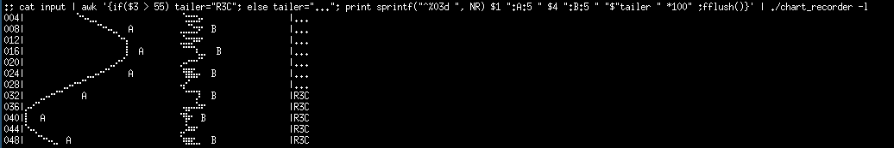

# A Chart Recorder Capable of Using Braille Characters

# Abstract

This describes a command line tool which can take a stream or text file
of data and render it as a plot in your terminal.  Use command line
tools like AWK to scale the data and apply thresholds, etc.

A complicated example might look like this:

    :; cat input | awk '{if($3 > 55) tailer="R3C"; else tailer="..."; printf("^%03d %d%s %d%s $%s *300\n",NR,$1*3,":A:10",$3*3,":B:15", tailer);fflush();}' | ./chart_recorder

If you are streaming live data then that plot will simply scroll up,
line by line as new data arrives.

# Background

I spend most of my time at work logged into remote machines over SSH. I've
found TMUX to be a useful companion as it's fairly common to see the
connections drop.  I've used XTerm for as long as I've used X and,
to be honest, I'm very happy with that.

Another feature of my job is that there are streaming data sources which
I want to look at. Sometimes we have data pouring out of a system over
UDP but it's never hard to turn that into a stream of numbers - often a
timestamp in the first column and decimal values in one or more columns
to the right, space separated. Think of those lines just streaming
from stdout.

Graphs are good when you want to understand what's going on.

Sometimes I'll snip a chunk of that columnated data into a file, launch
Octave and plot the results. More often than not, I won't have X over SSH
so I'll get a nice ASCII plot - which is certainly better than nothing.

On other occasions, I've used AWK to draw out the data as ASCII `*`
characters - offset by the data value - an allowed those to spool up
the screen as the readings come in. That format vaguely represents a
low-res old fashioned chart recorder.  It's easy and surprisingly good
for a quick look.

XTerm - and many of its modern counterparts support Braille characters.
Every character cell on the screen can contain 8 pixels - four high and
two wide. So I can immediately increase my chart recorder resolution and
remain in the comfortable XTerm environment.

I've written a program to do just that. Counter to the spirit of proper
UNIX applications, I've made it do two things badly instead of one thing
well: the program can output the low-res `*` format, too.

# Instructions

This tool has a few options on the command line and a simple line oriented
input for the data. The data line format is, at it's most basic, a space separated
list of decimal values. Annotations can be added but often you will only want
the simplest case to make an initial assessment.

There is a file called input in this directory, I'll use that throughout.

    :; head input
       20   40   50   61
       22   40   50   66
       24   40   50   68
       27   40   50   62
       29   41   50   64
       31   41   51   68
       33   41   51   67
       35   42   51   60
       36   42   51   61
       38   42   51   68

As you can see, it's just columns of numbers.

# The simplest case

Please note, Github has messed up the braille layout a bit, TBH it's a lot to ask of Markdown!

Print out the first column of numbers in Braille characters.

    :; cat input | awk '{print $1;fflush()}' | ./chart_recorder
              ⠑⠢⢄⣀
                  ⠉⠒⠤⣀
                      ⠑⢢
                       ⢸
                    ⢀⡠⠒⠁
                ⣀⡠⠔⠊⠁
           ⢀⡠⠔⠒⠉
       ⣀⠤⠒⠉⠁
    ⡠⠔⠉
    ⡇
    ⠑⠤⡀
      ⠈⠑⠢⢄⡀

The fflush isn't necessary in this case - with a file input - but it's useful
for streaming data so things get sent through AWK without delay.

To view that as old school `*` characters, note the truncation using head:

    :; cat input | awk '{print $1;}' | ./chart_recorder -c | head -15
                        *
                         **
                           **
                             ***
                                **
                                  **
                                    **
                                      **
                                        *
                                         **
                                           *
                                           *
                                           *
                                           *
                                           *

A couple of columns ...

    :; cat input | awk '{print $1 " " $4;fflush()}' | ./chart_recorder
              ⠑⠢⢄⣀                ⠈⣒⣒⣢⠄
                  ⠉⠒⠤⣀            ⣀⣈⣑⡲⠂
                      ⠑⢢          ⣈⣒⡲⠶⠂
                       ⢸          ⠈⠉⠉⢆⣀
                    ⢀⡠⠒⠁          ⡠⠔⠒⠊⠁
                ⣀⡠⠔⠊⠁             ⠘⣿⣯⡤
           ⢀⡠⠔⠒⠉                  ⢤⠊
       ⣀⠤⠒⠉⠁                       ⠉⠉⡹
    ⡠⠔⠉                           ⠠⣤⠤⠵⠖
    ⡇                             ⠙⡷⠂
    ⠑⠤⡀                           ⣀⠵⠶⠂
      ⠈⠑⠢⢄⡀                       ⠱⣶⣖⣀

Labelling the traces, the data values have a :LABEL suffix - there is a
ten character limit to that.

    :; cat input | awk '{print $1 ":A " $4 ":B" ;fflush()}' | head -5
    20:A 61:B
    22:A 66:B
    24:A 68:B
    27:A 62:B
    29:A 64:B
    :; cat input | awk '{print $1 ":A " $4 ":B" ;fflush()}' | ./chart_recorder
              ⠑⠢⢄⣀  A             ⠈⣒⣒⣢⠄ B
                  ⠉⠒⠤⣀  A         ⣀⣈⣑⡲⠂ B
                      ⠑⢢  A       ⣈⣒⡲⠶⠂ B
                       ⢸  A       ⠈⠉⠉⢆⣀  B
                    ⢀⡠⠒⠁  A       ⡠⠔⠒⠊⠁  B
                ⣀⡠⠔⠊⠁   A         ⠘⣿⣯⡤  B
           ⢀⡠⠔⠒⠉    A             ⢤⠊    B
       ⣀⠤⠒⠉⠁   A                   ⠉⠉⡹  B
    ⡠⠔⠉   A                       ⠠⣤⠤⠵⠖  B
    ⡇  A                          ⠙⡷⠂ B
    ⠑⠤⡀ A                         ⣀⠵⠶⠂ B
      ⠈⠑⠢⢄⡀ A                     ⠱⣶⣖⣀  B

A bit much, right - but we can dilute that and space the labels out a
bit with a further :N numerical suffix - which puts gaps between the
lable lines.

    :; cat input | awk '{print $1 ":A:5 " $4 ":B:5" ;fflush()}' | head -5
    20:A:5 61:B:5
    22:A:5 66:B:5
    24:A:5 68:B:5
    27:A:5 62:B:5
    29:A:5 64:B:5
    :; cat input | awk '{print $1 ":A:5 " $4 ":B:5" ;fflush()}' | ./chart_recorder
              ⠑⠢⢄⣀                ⠈⣒⣒⣢⠄
                  ⠉⠒⠤⣀  A         ⣀⣈⣑⡲⠂ B
                      ⠑⢢          ⣈⣒⡲⠶⠂
                       ⢸  A       ⠈⠉⠉⢆⣀  B
                    ⢀⡠⠒⠁          ⡠⠔⠒⠊⠁
                ⣀⡠⠔⠊⠁   A         ⠘⣿⣯⡤  B
           ⢀⡠⠔⠒⠉                  ⢤⠊
       ⣀⠤⠒⠉⠁   A                   ⠉⠉⡹  B
    ⡠⠔⠉                           ⠠⣤⠤⠵⠖
    ⡇  A                          ⠙⡷⠂ B
    ⠑⠤⡀                           ⣀⠵⠶⠂
      ⠈⠑⠢⢄⡀ A                     ⠱⣶⣖⣀  B

If this is time series data, it might be nice to have the time displayed on
the left. Add a header to the line using the `^` prefix. For best results that
needs to be a fixed width field. I'll simulate it here with AWK using the
record counter.

    :; cat input | awk '{print sprintf("^%03d ", NR) $1 ":A:5 " $4 ":B:5" ;fflush()}' | head -5
    ^001 20:A:5 61:B:5
    ^002 22:A:5 66:B:5
    ^003 24:A:5 68:B:5
    ^004 27:A:5 62:B:5
    ^005 29:A:5 64:B:5
    :; cat input | awk '{print sprintf("^%03d ", NR) $1 ":A:5 " $4 ":B:5" ;fflush()}' | ./chart_recorder
    004|          ⠑⠢⢄⣀                ⠈⣒⣒⣢⠄
    008|              ⠉⠒⠤⣀  A         ⣀⣈⣑⡲⠂ B
    012|                  ⠑⢢          ⣈⣒⡲⠶⠂
    016|                   ⢸  A       ⠈⠉⠉⢆⣀  B
    020|                ⢀⡠⠒⠁          ⡠⠔⠒⠊⠁
    024|            ⣀⡠⠔⠊⠁   A         ⠘⣿⣯⡤  B
    028|       ⢀⡠⠔⠒⠉                  ⢤⠊
    032|   ⣀⠤⠒⠉⠁   A                   ⠉⠉⡹  B
    036|⡠⠔⠉                           ⠠⣤⠤⠵⠖
    040|⡇  A                          ⠙⡷⠂ B
    044|⠑⠤⡀                           ⣀⠵⠶⠂
    048|  ⠈⠑⠢⢄⡀ A                     ⠱⣶⣖⣀  B

You'll notice that the numbers on the left go up in steps of four. There are four
pixel rows per line, so something's got to give.

Similarly, it's nice to have space on the end of a line to add text. Let's pretend
the third row is the temperature of Reactor Number 3 and that if it exceeds 55 units
then something bad has happened (incidentally, I specifically forbid you from using
this shonky code in safety critical applications). However:

    :; cat input | awk '{if($3 > 55) tailer="R3C"; else tailer="..."; print sprintf("^%03d ", NR) $1 ":A:5 " $4 ":B:5 " "$"tailer " *100" ;fflush()}' | head -5
    ^001 20:A:5 61:B:5 $... *100
    ^002 22:A:5 66:B:5 $... *100
    ^003 24:A:5 68:B:5 $... *100
    ^004 27:A:5 62:B:5 $... *100
    ^005 29:A:5 64:B:5 $... *100
    :; cat input | awk '{if($3 > 55) tailer="R3C"; else tailer="..."; print sprintf("^%03d ", NR) $1 ":A:5 " $4 ":B:5 " "$"tailer " *100" ;fflush()}' | ./chart_recorder
    004|          ⠑⠢⢄⣀                ⠈⣒⣒⣢⠄                |...
    008|              ⠉⠒⠤⣀  A         ⣀⣈⣑⡲⠂ B              |...
    012|                  ⠑⢢          ⣈⣒⡲⠶⠂                |...
    016|                   ⢸  A       ⠈⠉⠉⢆⣀  B             |...
    020|                ⢀⡠⠒⠁          ⡠⠔⠒⠊⠁                |...
    024|            ⣀⡠⠔⠊⠁   A         ⠘⣿⣯⡤  B              |...
    028|       ⢀⡠⠔⠒⠉                  ⢤⠊                   |...
    032|   ⣀⠤⠒⠉⠁   A                   ⠉⠉⡹  B              |R3C
    036|⡠⠔⠉                           ⠠⣤⠤⠵⠖                |R3C
    040|⡇  A                          ⠙⡷⠂ B                |R3C
    044|⠑⠤⡀                           ⣀⠵⠶⠂                 |R3C
    048|  ⠈⠑⠢⢄⡀ A                     ⠱⣶⣖⣀  B              |R3C

You will notice that I added `*100` to the line - for tidiness. It sets the
total width to 100 from the start. Also, about half way down Reactor Number
3 goes critical (Bad, not terrible).

# Command line flags

You've seen some of these already, but:

    -c Character mode, in case Braille characters are too small
    -l Line mode, waits for a complete Braille instead of overwriting and updating per pixel. Might be better if you are writing to a file?
    -d Draw dots instead of trying to draw lines between this reading and its predecessor

# Building

    make all

Gives you a `chart_recorder` executable. If it's too slow then you can
build with `-O3` but since this is an application which writes to your
terminal and may be going over SSH, I doubt this will be the problem.

# Related

Every so often I think that a program like this will be a great idea. That
tends not to be the case.

    https://github.com/sjaturner/textscope
    https://github.com/sjaturner/pbmbr

# Apologies, Regrets

The code is neither concise, nor stylish. Wrote this in C and in
retrospect, I can't think why.

In retrospect, not sure I like the `$` character as an indicator for the 
end of line tag. Seem to get away with it though ...

# Final thoughts

Maybe, when all the machines I use are running a version of TMUX which
supports Sixel characters I'll do the whole thing again.
